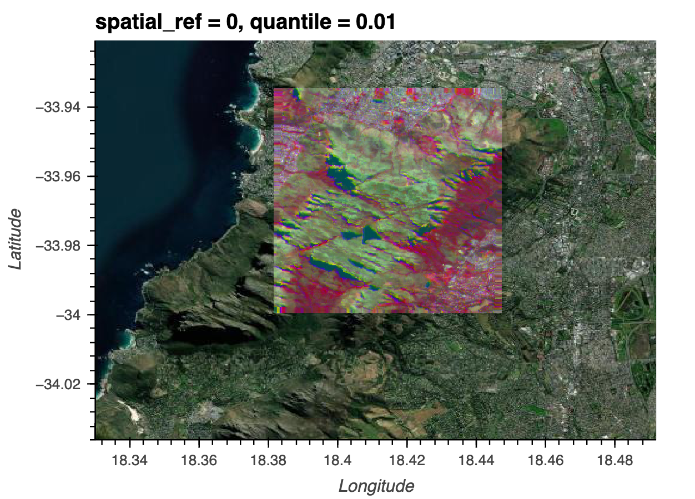

# xarray-enmap
notebooks to get started working with enmap hyperspectral data in python

-----

The best way to get started with data from the [DLR](https://www.dlr.de/EN/Home/home_node.html) hyperspectral mission [EnMap](https://www.enmap.org/) is to use the QGIS plugin EnMAP box. 

If you want to do analyses on large multi-image mosaics, fuse EnMAP with other satellite data, or do some scalable ML, you will need to use python tools like xarray and dask. This repo contains a notebook to get you started with using EnMAP data in python with xarray and doing some ML using dask-ml. This notebook is very basic and leaves out many data quality checks and model checks that you should do in a real-world setting.

To get access to EnMAP data sign up [here](https://planning.enmap.org/)

